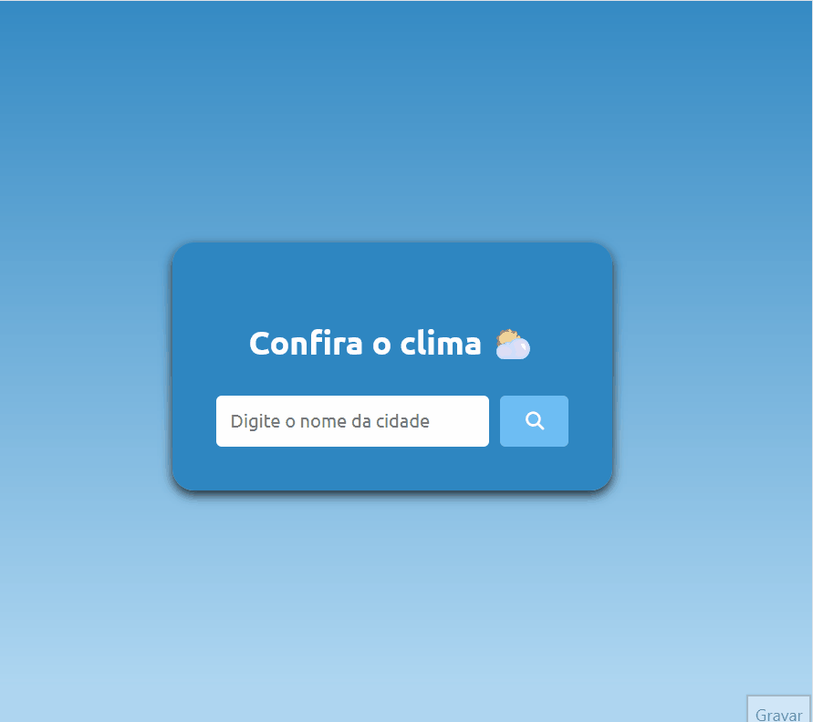

# Weather App ⛅

This project is a simple weather application that allows users to check the current weather conditions of any city. It utilizes the [OpenWeatherMap API](https://openweathermap.org/api) to retrieve weather data and the [Flags API](https://flagsapi.com/) to display the corresponding country flag.


## Features
- **Weather Information:** Displays temperature, weather description, and a weather icon representing the current conditions.
- **Location Details:** Shows the city name along with the flag of the corresponding country.

- **Additional Details:** Includes humidity and wind speed for a more comprehensive overview.

## API Keys
To run the application, you need to obtain an API key from [OpenWeatherMap API](https://openweathermap.org/api) and replace the apiKey variable in the script.js file.

```javascript
const apiKey = "your_openweathermap_api_key";
```

## Overview




